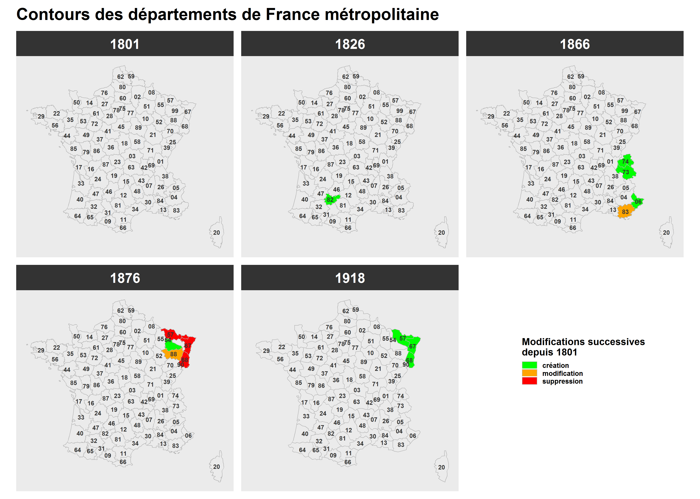
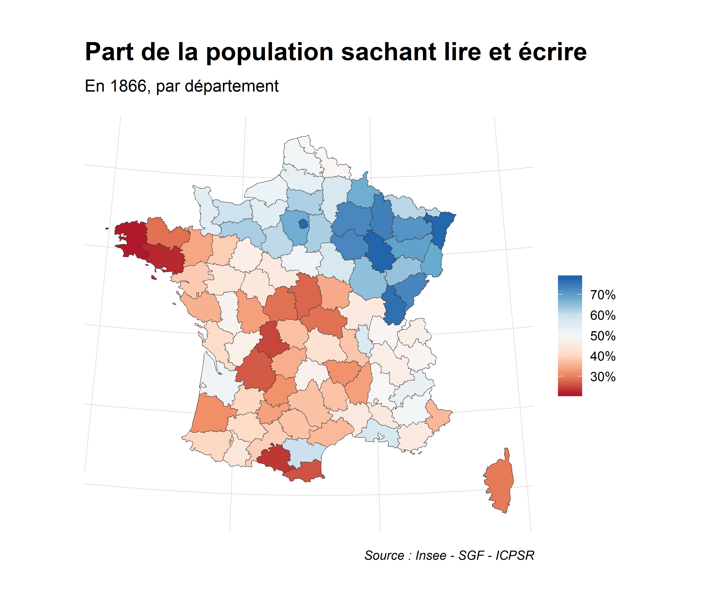
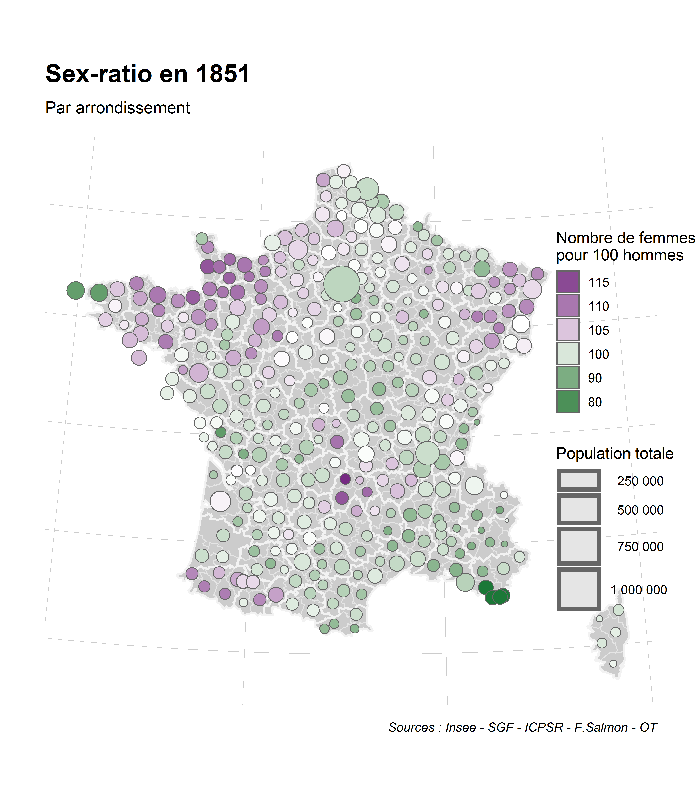

<!-- README.md is generated from README.Rmd. Please edit that file -->

# SGF

La SGF (pour *Statistique Générale de la France*) est [l’ancêtre de
l’Insee](https://www.insee.fr/fr/information/1300622), à savoir un
service ministériel chargé de collecter et analyser des statistiques
pour le gouvernement français entre 1833 et 1940.

Une partie de ces données a été saisie dans les années 1980 par une
équipe de chercheurs franco-américains à l’Inter-University Consortium
for Political and Social Research (ICPSR), situé à Ann Arbor, Michigan,
États-Unis. L’Insee a [publié
ici](https://www.insee.fr/fr/statistiques/2591397) 200 tableurs au
format dbf portant sur les recensements de la population, la démographie
et l’enseignement primaire, entre 1800 et 1925.

Le package `sgf` regroupe, normalise et documente ces indicateurs
disponibles dans la plupart des cas à l’échelon géographique du
département (des arrondissements voire des chefs-lieux
d’arrondissements dans quelques rares cas). Il permet également de
cartographier ces indicateurs au millésime géographique du département
ou de l’arrondissement correspondant au millésime de la donnée.

`sgf` est composé de :

  - 2 tables de données (format dataframe) :
      - **indicateurs\_SGF** : description des 40 000 indicateurs
        disponibles (libellé, identifiant, millésime de la donnée,
        échelles géographiques disponibles et millésime de la
        géographie)
      - **data\_SGF** : table contenant l’ensemble des données en format
        long (libellés, identifiants, millésime de la donnée et
        millésime de la géographie)
  - 2 tables de données géographiques (format sf dataframe) :
      - **geo\_DEP\_SGF\_histo** : contours géographiques des
        départements (avec leur code et libellé) selon le millésime de
        la géographie (1801/1826/1866/1876/1918, cf. "géographie
        ci-dessous)
      - **geo\_ARR\_SGF\_histo** : contours géographiques des
        arrondissements (avec leur code et libellé) selon le millésime
        de la géographie (1801/1826/1876, cf. "géographie ci-dessous)
  - 1 fonction :
      - **sgf\_sfdf** : après avoir identifié les indicateurs de son
        choix dans la table **indicateurs\_SGF**, cette fonction permet
        de créer un sf dataframe avec les indicateurs en format large

## Sources et crédits

Données statistiques : SGF, ICPSR, Insee,
[insee.fr/fr/information/1300622](https://www.insee.fr/fr/information/1300622)

Fonds cartographiques : F. Salmon, 2019,
[fondsdecarte.free.fr/](http://fondsdecarte.free.fr/)

Documentation, géoréférencement : Observatoire des Territoires.

## Installation

Le package `sgf` peut être installé depuis
[github](https://github.com/observatoire-territoires/sgf) via la
commande suivante :

``` r
remotes::install_github("observatoire-territoires/sgf")
```

Pour accéder à la documentation décrivant les tables de données, par
exemple celle listant les indicateurs :

``` r
?sgf::indicateurs_SGF
```

## Géographie

Les contours des départements de France métropolitaine ont évolué sur la
période que couvre les données de la SGF. Les 5 millésimes de cette
géographie départementale sont disponibles dans la table
`geo_DEP_SGF_histo` (idem pour les contours des arrondissements dans la
table `geo_ARR_SGF_histo`)
:



## Démo

La recherche des indicateurs se fait directement dans la table
**indicateurs\_SGF** :

``` r
library(sgf)
```

``` r
View(indicateurs_SGF)
```

Une fois le niveau géographique (variable ‘TYPE\_NIVGEO’), la source
(variable ‘TABLEAU’) et l’identifiant (variable ‘VAR\_COD’) des
indicateurs sélectionnés, la fonction **sgf\_sfdf** permet de générer un
sf dataframe des territoires avec les indicateurs correspondants, au
format large :

``` r
DEP_pop_1866 <-
  sgf_sfdf(TYPE_NIVGEO = "DEP",
           SRC ="REC_T25",
           LISTE_VAR_COD = c(215, 177, 183))

glimpse(DEP_pop_1866)
#> Observations: 89
#> Variables: 7
#> $ CODGEO                                      <chr> "01", "02", "03", ...
#> $ LIBGEO                                      <chr> "AIN", "AISNE", "A...
#> $ ANNEE_GEOGRAPHIE                            <dbl> 1866, 1866, 1866, ...
#> $ geometry                                    <GEOMETRY [m]> POLYGON (...
#> $ aveugles_total_1866                         <dbl> 318, 659, 219, 168...
#> $ personnes_sachant_lire_et_ecrire_total_1866 <dbl> 178797, 324069, 10...
#> $ total_general_de_la_population_total_1866   <dbl> 365895, 561620, 37...
```

Puis on peut cartographier le tout avec `ggplot` par exemple :

``` r
library(ggplot2)
library(scales)
library(hrbrthemes)

ggplot() +
  geom_sf(data = DEP_pop_1866 %>%
            mutate(personnes_sachant_lire_et_ecrire_total_1866_pct = 
                     personnes_sachant_lire_et_ecrire_total_1866 / total_general_de_la_population_total_1866),
          aes(fill= personnes_sachant_lire_et_ecrire_total_1866_pct),
          color = "grey20",
          lwd = 0.15) +
  scale_fill_distiller(name = "", palette = "RdBu",
                       labels = percent_format(accuracy =1),
                       direction = 1) +
  theme_ipsum() +
  theme(axis.text = element_blank(), axis.title  = element_blank(), axis.ticks  = element_blank()) +
  labs(
    title = "Part de la population sachant lire et écrire",
    subtitle = "En 1866, par département",
    caption = "Sources : Insee - SGF - ICPSR - F.Salmon - OT"
  )
```



Autre exemple avec une cartographie d’un indicateur à la maille
arrondissement en symboles proportionnels :

``` r

ARR_pop_sexe_1851 <-
  sgf_sfdf(TYPE_NIVGEO = "ARR",
           SRC ="REC_T01",
           LISTE_VAR_COD = c(11,12,13,14)) %>%
  mutate(ratio_femmes_hommes_1851 = (total_du_sexe_feminin_1851 / total_du_sexe_masculin_1851) *100  )


ggplot() +
  geom_sf(data = ARR_pop_sexe_1851, fill="grey80", color = "grey90" , lwd = 0.35) +
  geom_sf(data = geo_DEP_SGF_histo %>% filter(ANNEE_GEOGRAPHIE == 1826), 
          fill=NA, color = "grey95", lwd = 0.75 ) +
  geom_sf(data = ARR_pop_sexe_1851 %>% st_centroid(of_largest_polygon=T),
          aes(fill= ratio_femmes_hommes_1851,
              size = total_du_sexe_masculin_1851 + total_du_sexe_feminin_1851 ),
          color = "grey40", shape = 21) +
  scale_fill_gradientn(colours = c("#1b7837", "white", "#762a83"),
                       name = "Nombre de femmes\npour 100 hommes",
                       breaks = c(70,80,90,100,105,110,115),
                       values = scales::rescale(c(70, 92, 100, 104, 115))) +
  scale_size_continuous(labels=function(x) format(x, big.mark = " ", scientific = FALSE),
                        range = c(1,12),
                        name = "Population totale") +
  guides(fill = guide_legend(reverse=T)) +
  theme_ipsum() +
  theme(axis.text = element_blank(), axis.title  = element_blank(), axis.ticks  = element_blank()) +
  labs(
    title = "Sex-ratio en 1851",
    subtitle = "Par arrondissement",
    caption = "Sources : Insee - SGF - ICPSR - F.Salmon - OT"
  ) +
  theme(legend.position = c(0.95,0.5),
        axis.line=element_blank(),
        axis.title=element_blank(),
        axis.text=element_blank() )
```


